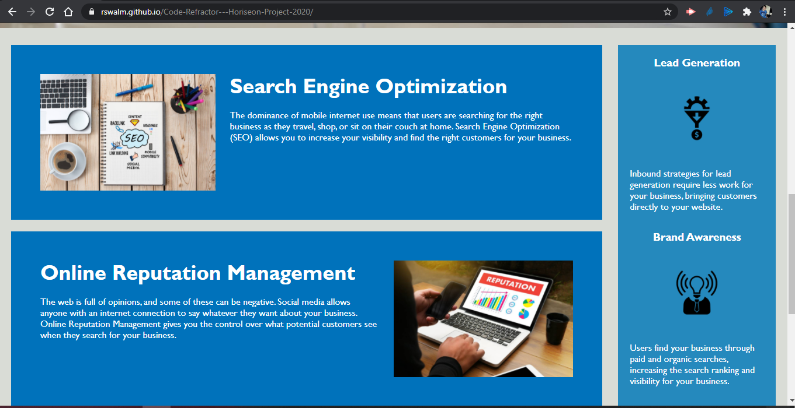
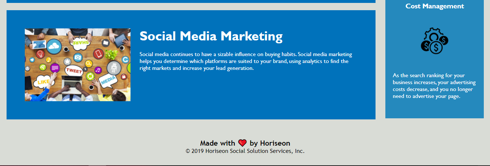

# Code Refractor

As per the criteria set out in the user story, I have refracted their existing code to meet a certain set of standards. Web asscessibilty is an increasingly important consideration for businesses, ensuring that people with disabilities or socio-economic restrictions have access to their website, and helping them avoid litigation, This has been implemented. All links are functioning correctly and the the CSS has been cleaned up to make it more efficient, consolidating CSS selectors and properties, organizing them to follow the semantic structure of the HTML elements, and including comments before each element or section of the page, are also things I have done to make the webpage meet the criteria requested by the user.

# This website now meets the following criteria:

* When viewing the source code, semantic HTML elements can now be found.
* When viewing the structure of the HTML elements, the elements now follow a logical structure independant of styling and positioning.
* Accessible alt attributes can now be seen when viewing the image elements.
* Heading attributes fall in sequential order.
* The title element now has a concise descriptive title
* I have put all comments in proper places so that there is no confusion for another developer who tries to make changes to this code.
* There were many css classes they were used uniquely which was not needed as copious elements were having same styles with different names.
* Link of image of first screen was written in css that is not a good programming trait so I have moved it to html file.
* Add all titles to images so that it describes when they hover to that image.

